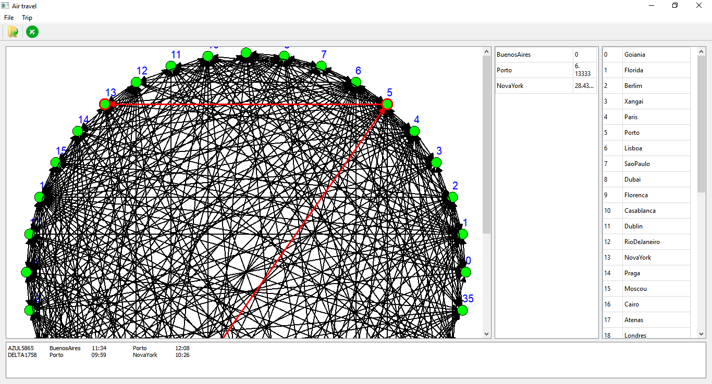
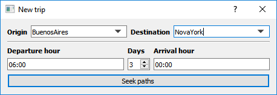

# AirTravelSystem
Air travel planning system for passengers

This tool calculates the flights and stopovers between any two cities in the database, in order to optimize the total time of the trip.
The client must inform the city of origin and the city of destination, and the tool will present the best flight option for the desired trip.
This solution is based on graph algorithms and was developed with C ++ and Qt.

Link: https://github.com/Jonlenes/AirTravelSystem

  

  

